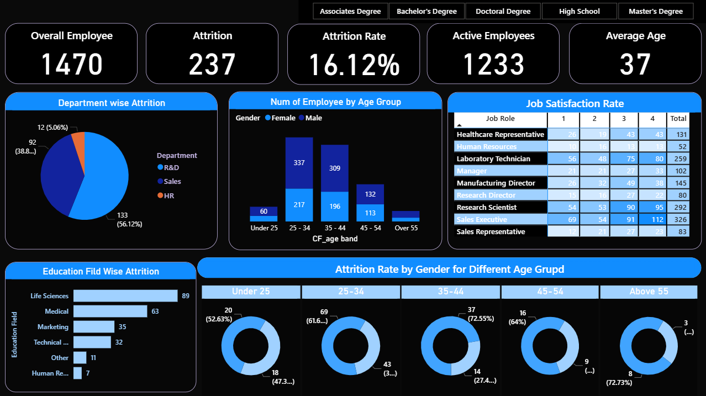

# HR Attrition Dashboard

This project analyzes employee attrition data using **Power BI**.  
It provides insights on department-wise attrition, education fields, age groups, gender distribution, and job satisfaction.

## Dashboard Preview

##  Files
- `HR Dashboard.pbix` → Power BI project file
- `HR Dashboard.png` → Dashboard image preview

##  Tools Used
- Power BI
- Data Analysis
- Data Visualization

##  Insights
- Highest attrition rate in Sales department (56.12%).
- Most affected age group: 25-34 years old.
- Life Sciences field shows the highest attrition by education.

